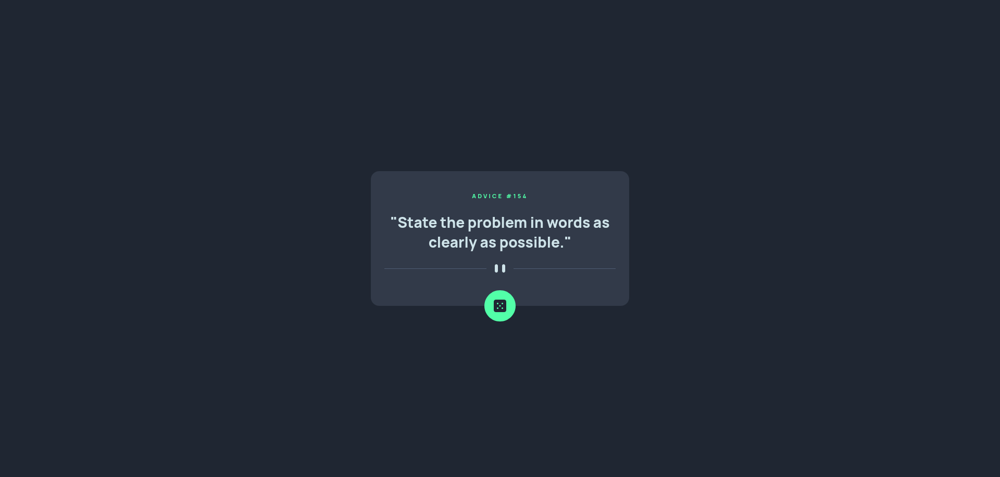

# Frontend Mentor - Advice generator app solution

This is a solution to the [Advice generator app challenge on Frontend Mentor](https://www.frontendmentor.io/challenges/advice-generator-app-QdUG-13db). Frontend Mentor challenges help you improve your coding skills by building realistic projects.

## Table of contents

- [Overview](#overview)
  - [The challenge](#the-challenge)
  - [Screenshot](#screenshot)
  - [Links](#links)
- [My process](#my-process)
  - [Built with](#built-with)
  - [What I learned](#what-i-learned)
  - [Continued development](#continued-development)
- [Author](#author)

## Overview

### The challenge

Users should be able to:

- View the optimal layout for the app depending on their device's screen size
- See hover states for all interactive elements on the page
- Generate a new piece of advice by clicking the dice icon

### Screenshot

### Links

- Solution URL: [GitHub](https://github.com/fushinori/frontendmentor/tree/master/advice-generator-app-main/)
- Live Site URL: [Live site](https://advice-generator-app-fushinori.netlify.app/)

## My process

### Built with

- Semantic HTML5 markup
- CSS custom properties
- Flexbox
- CSS Grid
- Mobile-first workflow
- [React](https://reactjs.org/) - JS library
- [Astro](https://astro.build/) - All-in-one web framework
- [CSS Modules](https://github.com/css-modules/css-modules/) - For styling components

### What I learned

Learned how to use the `fetch` API and the `useEffect` React Hook.

### Continued development

For more complex projects, I would like to try using [react-query](https://react-query-v3.tanstack.com/) for fetching and managing data.

## Author

- Frontend Mentor - [@fushinori](https://www.frontendmentor.io/profile/fushinori)
- GitHub - [@fushinori](https://github.com/fushinori)
