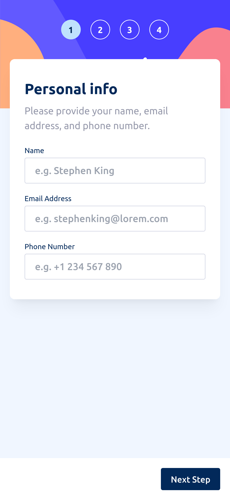
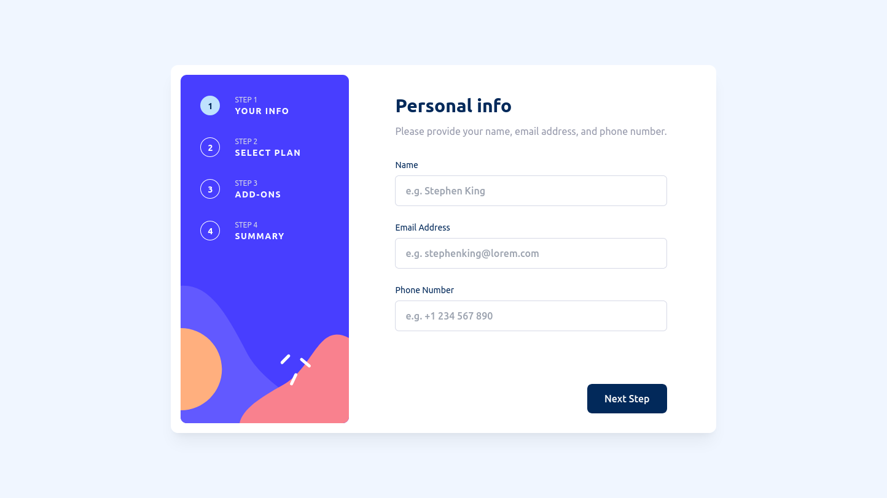
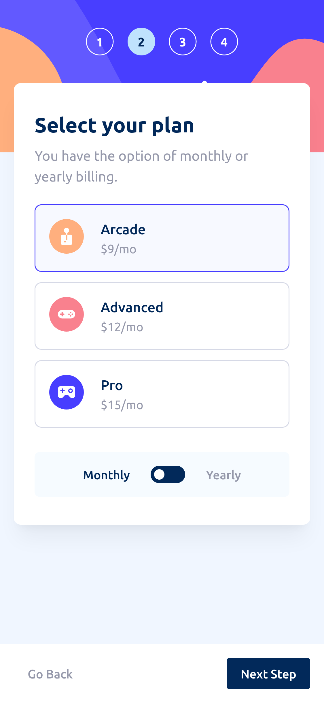
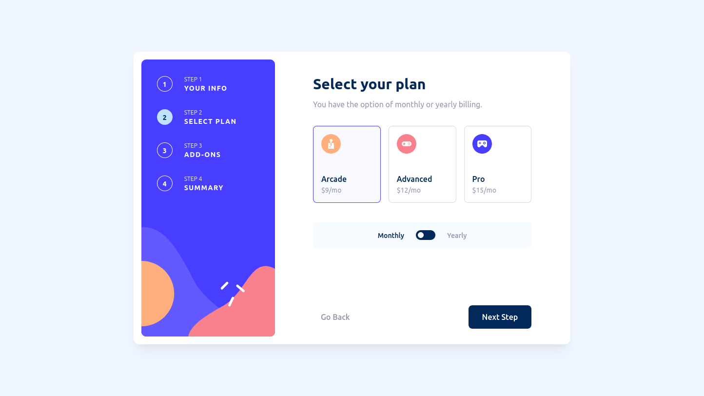

# Frontend Mentor - Multi-step form solution

This is a solution to the [Multi-step form challenge on Frontend Mentor](https://www.frontendmentor.io/challenges/multistep-form-YVAnSdqQBJ). Frontend Mentor challenges help you improve your coding skills by building realistic projects.

## Table of contents

- [Overview](#overview)
  - [The challenge](#the-challenge)
  - [Screenshots](#screenshots)
  - [Links](#links)
- [My process](#my-process)
  - [Built with](#built-with)
  - [What I learned](#what-i-learned)
  - [Continued development](#continued-development)
- [Author](#author)

## Overview

### The challenge

Users should be able to:

- Complete each step of the sequence
- See a summary of their selections on the final step and confirm their order
- View the optimal layout for the interface depending on their device's screen size
- See hover and focus states for all interactive elements on the page

### Screenshots









### Links

- Solution URL: [GitHub](https://github.com/fushinori/frontendmentor/tree/master/multi-step-form-main/)
- Live Site URL: [Live site](https://multi-step-form-fushinori.netlify.app/)

## My process

### Built with

- Semantic HTML5 markup
- Flexbox
- CSS Grid
- Mobile-first workflow
- [Preact](https://preactjs.com/) - JS library
- [Astro](https://astro.build/) - All-in-one web framework
- [Tailwind CSS](https://tailwindcss.com/) - For styles
- [React Hook Form](https://react-hook-form.com/) - For form validation

### What I learned

- Using react-hook-form, it is easy to render components if there are validation errors.

  For example, here we render the paragraph if the user doesn't fill in an input which is required.

  ```tsx
  {
    errors[name]?.type === "required" && (
      <p class="text-xs text-strawberry-red font-bold lg:text-sm">
        This field is required
      </p>
    );
  }
  ```

- For the plan cards and addon options, it's easy enough to get it looking like the design. However, when it comes to accessibility, things get complicated really quickly.

  My first thought for the plan cards was to use hidden radio inputs and style the cards based on its state. However, radio buttons don't trigger an event when they're unchecked. Similarly, for the addons, it makes semantic sense to use checkboxes. However, hiding them and using their state to style the options was complicated. Also, the design required custom checkboxes.

  Instead, I made both the plan cards and addon options focusable by adding a tab index and keydown event handlers. I also added some `<span>s` which are only visible to screen readers to provide additional information, like the currently selected plan and add-ons. I also used a `<span>` for the toggle to show which billing is currently selected.

  While not the perfect solution, everything is now keyboard navigable and matches the design.

### Continued development

I'd like to make more forms in the future. Using the `form` attribute for a button outside the form was something new I learned this time. More complicated form validation and actually doing something with the form data are some things I could use some practice in doing.

## Author

- Frontend Mentor - [@fushinori](https://www.frontendmentor.io/profile/fushinori)
- GitHub - [@fushinori](https://github.com/fushinori)
