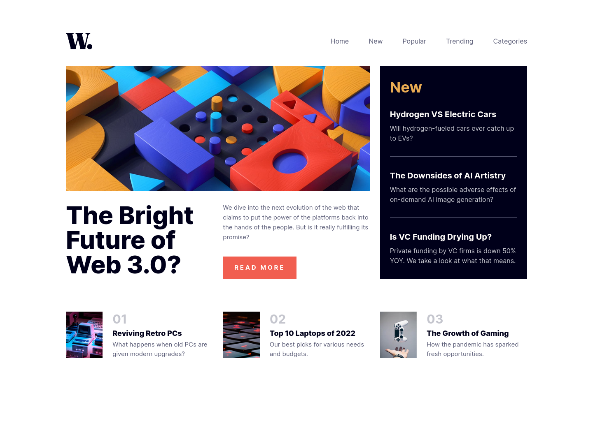
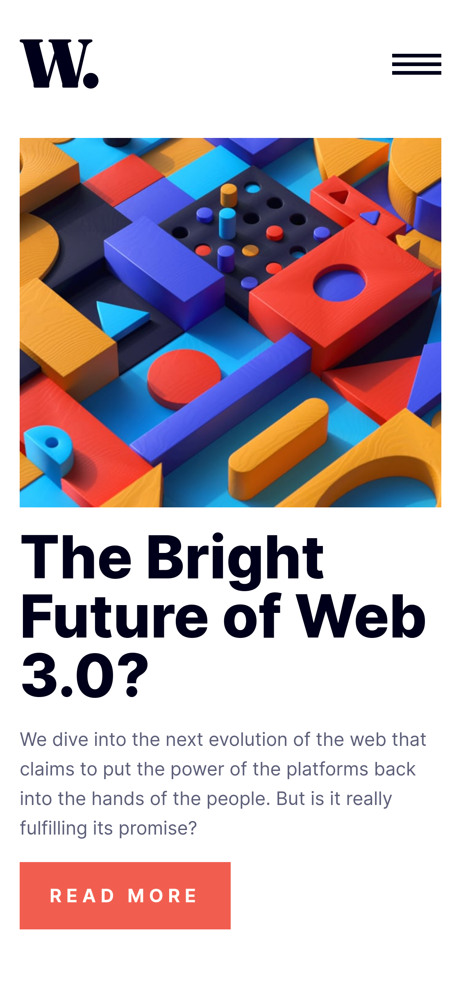

# Frontend Mentor - News homepage solution

This is a solution to the [News homepage challenge on Frontend Mentor](https://www.frontendmentor.io/challenges/news-homepage-H6SWTa1MFl). Frontend Mentor challenges help you improve your coding skills by building realistic projects.

## Table of contents

- [Overview](#overview)
  - [The challenge](#the-challenge)
  - [Screenshot](#screenshot)
  - [Links](#links)
- [My process](#my-process)
  - [Built with](#built-with)
  - [What I learned](#what-i-learned)
- [Author](#author)

## Overview

### The challenge

Users should be able to:

- View the optimal layout for the interface depending on their device's screen size
- See hover and focus states for all interactive elements on the page
- **Bonus**: Toggle the mobile menu (requires some JavaScript)

### Screenshot

### Links

- Solution URL: [GitHub](https://github.com/fushinori/frontendmentor/tree/master/news-homepage-main)
- Live Site URL: [Live site](https://news-homepage-fushinori.netlify.app/)

## My process

### Built with

- Semantic HTML5 markup
- Flexbox
- CSS Grid
- Mobile-first workflow
- [React](https://reactjs.org/) - JS library
- [Astro](https://astro.build/) - All-in-one web framework
- [Tailwind CSS](https://tailwindcss.com/) - For styles

### What I learned

This was my first time using Tailwind CSS. I can definitely see how it's useful especially when making components using React.

## Author

- Frontend Mentor - [@fushinori](https://www.frontendmentor.io/profile/fushinori)
- GitHub - [@fushinori](https://github.com/fushinori)
