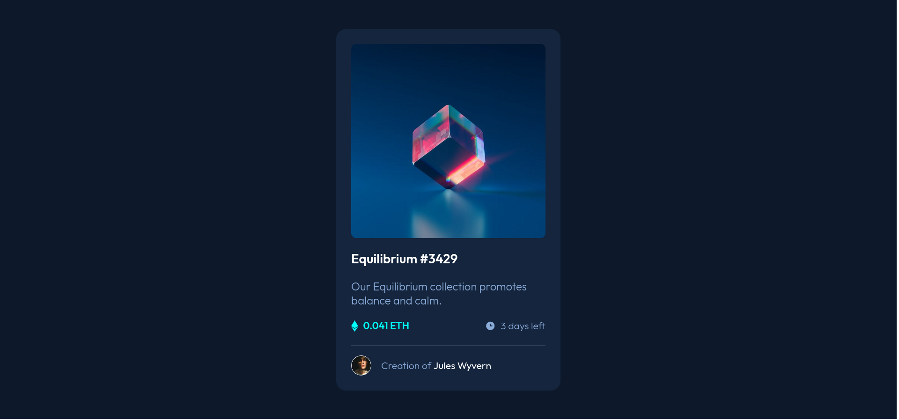

# Frontend Mentor - NFT preview card component solution

This is a solution to the [NFT preview card component challenge on Frontend Mentor](https://www.frontendmentor.io/challenges/nft-preview-card-component-SbdUL_w0U). Frontend Mentor challenges help you improve your coding skills by building realistic projects. 

## Table of contents

- [Overview](#overview)
  - [The challenge](#the-challenge)
  - [Screenshot](#screenshot)
  - [Links](#links)
- [My process](#my-process)
  - [Built with](#built-with)
  - [What I learned](#what-i-learned)
  - [Useful resources](#useful-resources)
- [Author](#author)

## Overview

### The challenge

Users should be able to:

- View the optimal layout depending on their device's screen size
- See hover states for interactive elements

### Screenshot



### Links

- Solution URL: [Add solution URL here](https://your-solution-url.com)
- Live Site URL: [Add live site URL here](https://your-live-site-url.com)

## My process

### Built with

- Semantic HTML5 markup
- CSS custom properties
- Flexbox

### What I learned

I learned how to add overlays without adding additional containers by making use of the ```::before``` pseudo-element.

### Useful resources

- [Kevin Powell](https://www.youtube.com/watch?v=lRPguPbovro) - In particular, this video gave me ideas on how to use the ```:before``` and ```::after``` elements to add overlays.

## Author

- Frontend Mentor - [@fushinori](https://www.frontendmentor.io/profile/fushinori)
- GitHub - [@fushinori](https://www.github.com/fushinori)