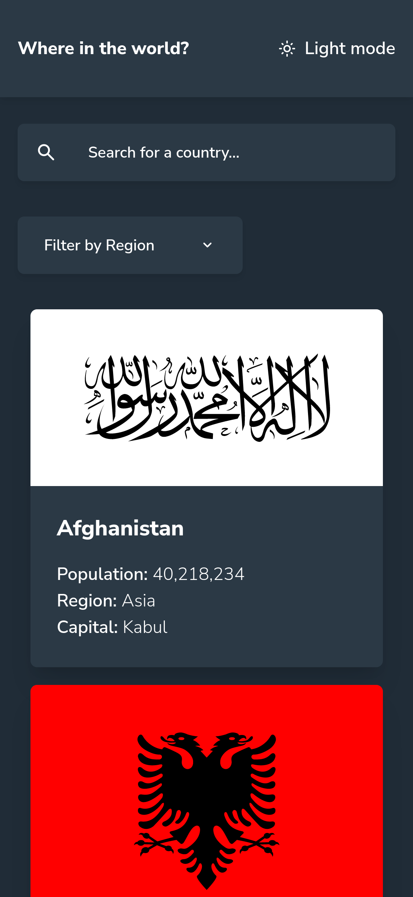
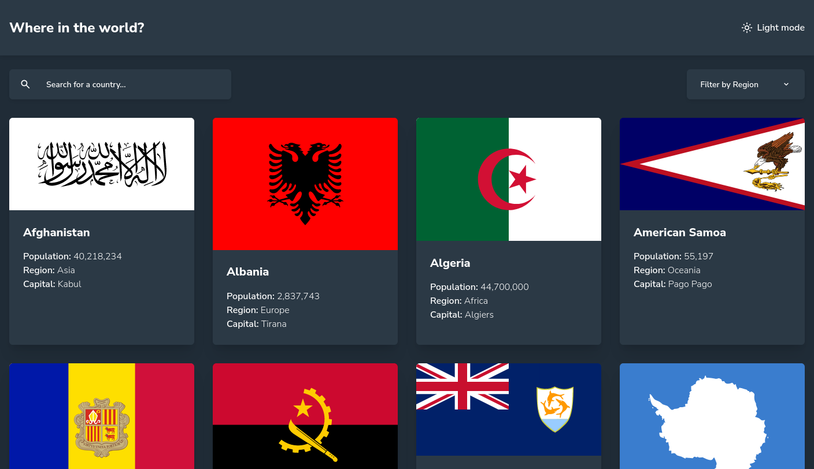
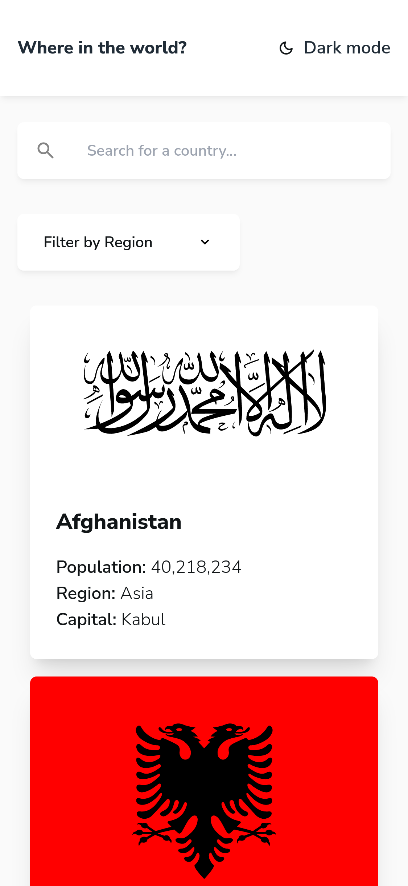
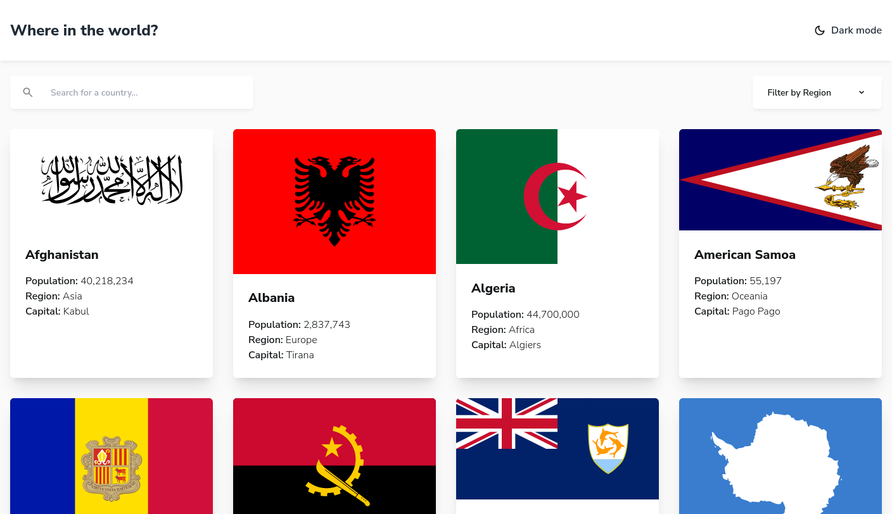
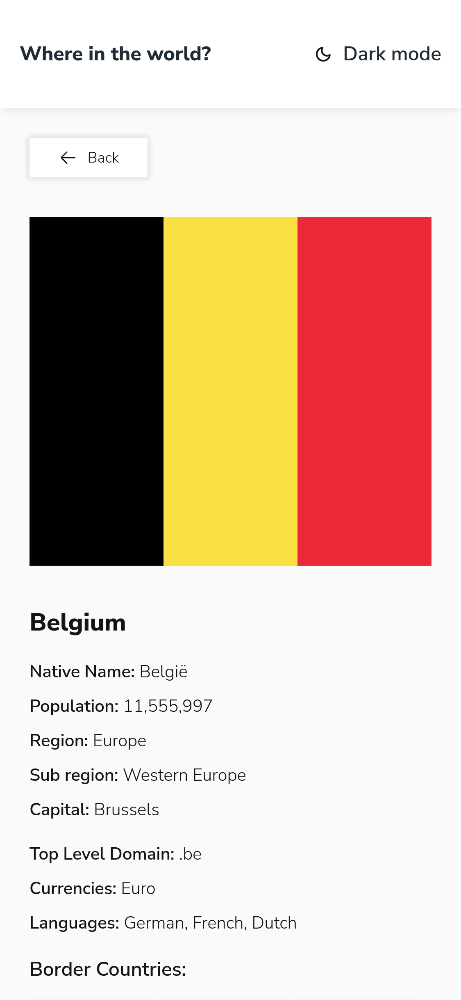
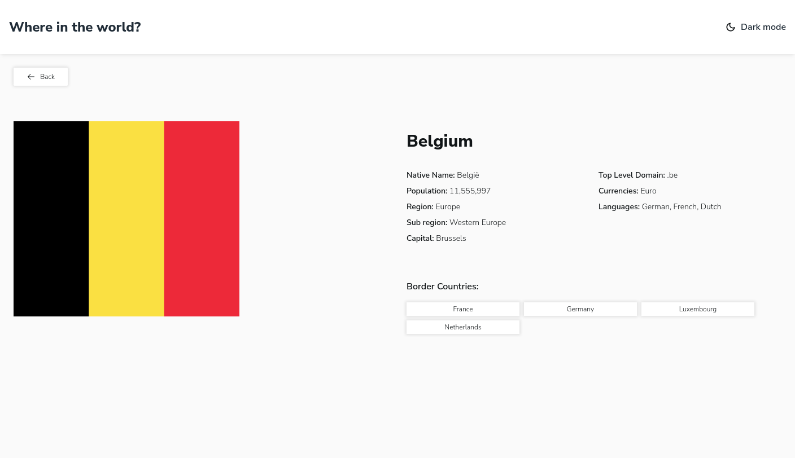
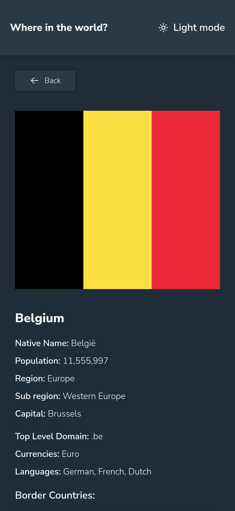
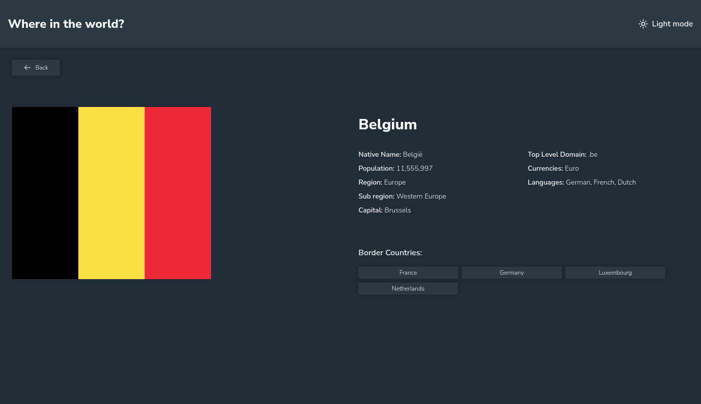

# Frontend Mentor - REST Countries API with color theme switcher solution

This is a solution to the [REST Countries API with color theme switcher challenge on Frontend Mentor](https://www.frontendmentor.io/challenges/rest-countries-api-with-color-theme-switcher-5cacc469fec04111f7b848ca). Frontend Mentor challenges help you improve your coding skills by building realistic projects.

## Table of contents

- [Overview](#overview)
  - [The challenge](#the-challenge)
  - [Screenshots](#screenshots)
  - [Links](#links)
- [My process](#my-process)
  - [Built with](#built-with)
  - [What I learned](#what-i-learned)
  - [Continued development](#continued-development)
- [Author](#author)

## Overview

### The challenge

Users should be able to:

- See all countries from the API on the homepage
- Search for a country using an `input` field
- Filter countries by region
- Click on a country to see more detailed information on a separate page
- Click through to the border countries on the detail page
- Toggle the color scheme between light and dark mode _(optional)_

### Screenshots

More

### Links

- Solution URL: [GitHub](https://github.com/fushinori/frontendmentor/tree/master/rest-countries-api-main/)
- Live Site URL: [Live site](https://rest-countries-fushinori.netlify.app/)

## My process

### Built with

- Semantic HTML5 markup
- Flexbox
- CSS Grid
- Mobile-first workflow
- [SvelteKit](https://kit.svelte.dev/) - JS meta framework
- [Tailwind CSS](https://tailwindcss.com/) - For styles

### What I learned

- Implementing dark mode support turned out to be harder than expected. FOUC (flash of unstyled content) was the main issue which needed to be solved.

  Tailwind's `dark:` variant works by adding the dark class to a root html element. The user's theme preference is saved in localStorage. Since Javascript is usually executed after the HTML and CSS load, there is a FOUC before the user's preference is fetched from the local storage. This can be prevented by executing the Javascript for adding the dark class in the `<head>` element.

  The same issue came up when implementing the button to change themes. Since the icon and text depend on the current theme, changing the button based on the user's preferences resulted in a FOUC again. This was circumvented by using two buttons and toggling their `display` property with the `dark:` variant. This however, made it impossible to use transitions since they aren't supported for the `display` property. Instead, I went with a `@keyframes` animation mimicking a fade transition. This worked fine but resulted in a new problem; the animation would trigger during the first page load and subsequent refreshes. This was fixed by adding the animation class only if the user clicks the button.

- Going with [Svelte Headless UI](https://svelte-headlessui.goss.io/) for the dropdown menu was a good decision as opposed to writing all the code myself. Headless UI gives completely unstyled yet fully accessible components. Implementing all accessibility best practices would have been a nightmare otherwise.

- Fuzzy searching using [Fuse.js](https://fusejs.io/) was extremely simple to implement.

### Continued development

- Pagination seems like a decent next step to implement for this website, along with some stylistic improvements.

## Author

- Frontend Mentor - [@fushinori](https://www.frontendmentor.io/profile/fushinori)
- GitHub - [@fushinori](https://github.com/fushinori)
