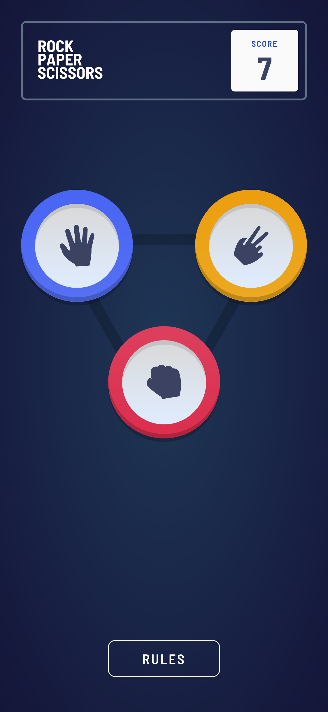
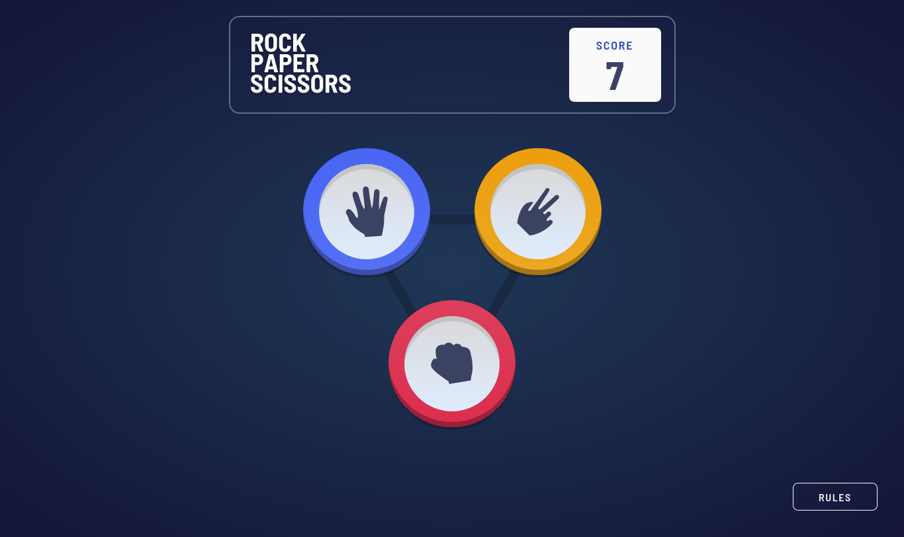
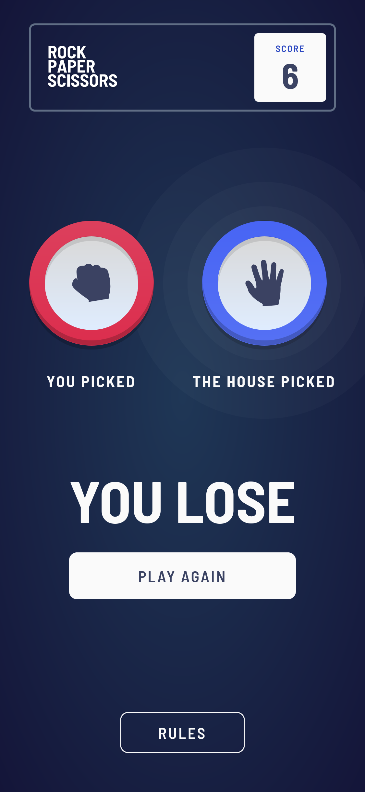
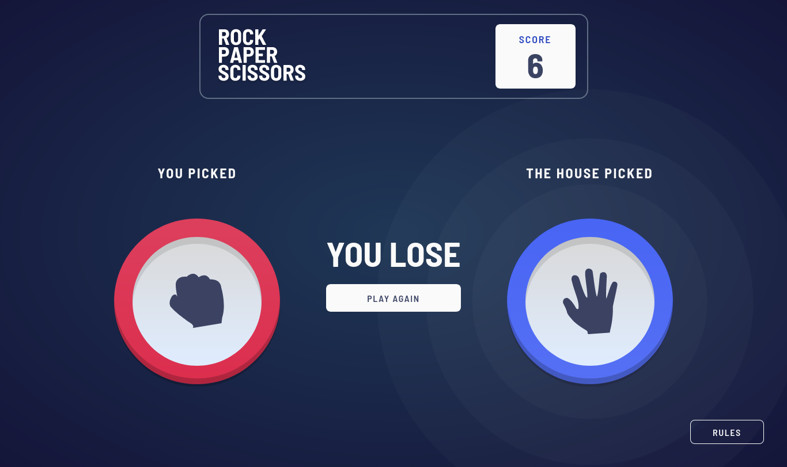

# Frontend Mentor - Rock, Paper, Scissors solution

This is a solution to the [Rock, Paper, Scissors challenge on Frontend Mentor](https://www.frontendmentor.io/challenges/rock-paper-scissors-game-pTgwgvgH). Frontend Mentor challenges help you improve your coding skills by building realistic projects.

## Table of contents

- [Overview](#overview)
  - [The challenge](#the-challenge)
  - [Screenshot](#screenshot)
  - [Links](#links)
- [My process](#my-process)
  - [Built with](#built-with)
  - [What I learned](#what-i-learned)
  - [Continued development](#continued-development)
- [Author](#author)

## Overview

### The challenge

Users should be able to:

- View the optimal layout for the game depending on their device's screen size
- Play Rock, Paper, Scissors against the computer
- Maintain the state of the score after refreshing the browser _(optional)_
- **Bonus**: Play Rock, Paper, Scissors, Lizard, Spock against the computer _(optional)_

### Screenshot

### Links

- Solution URL: [GitHub](https://github.com/fushinori/frontendmentor/tree/master/rock-paper-scissors-main/)
- Live Site URL: [Live site](https://rock-paper-scissors-fushinori.netlify.app/)

## My process

### Built with

- Semantic HTML5 markup
- CSS custom properties
- Flexbox
- CSS Grid
- Mobile-first workflow
- [Preact](https://preactjs.com/) - JS library
- [Astro](https://astro.build/) - All-in-one web framework
- [Tailwind CSS](https://tailwindcss.com/) - For styles

### What I learned

- Accessibility for modals
  - Trapping focus when modal is open.
  - Various aria attributes.

### Continued development

Accessibility is still something I'm not 100% adept in implementing. I'd like to learn more about it and focus on it in future projects.

## Author

- Frontend Mentor - [@fushinori](https://www.frontendmentor.io/profile/fushinori)
- GitHub - [@fushinori](https://github.com/fushinori)
